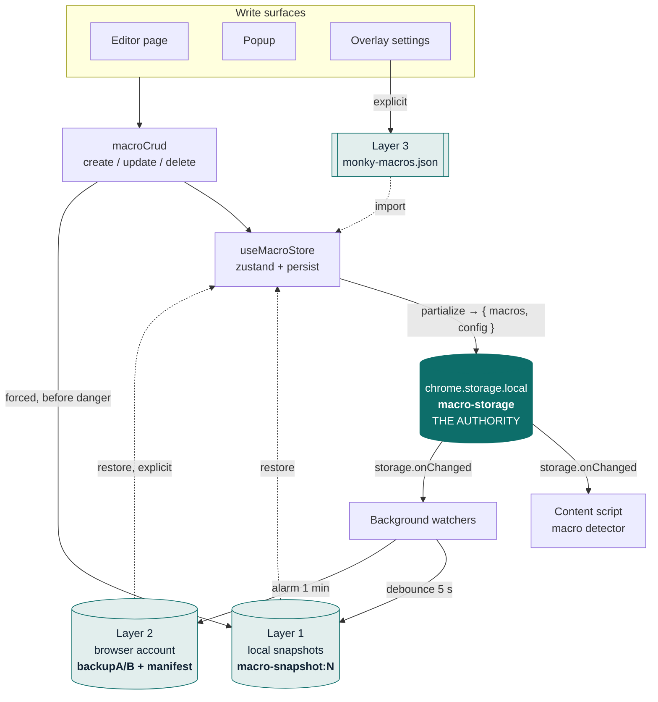
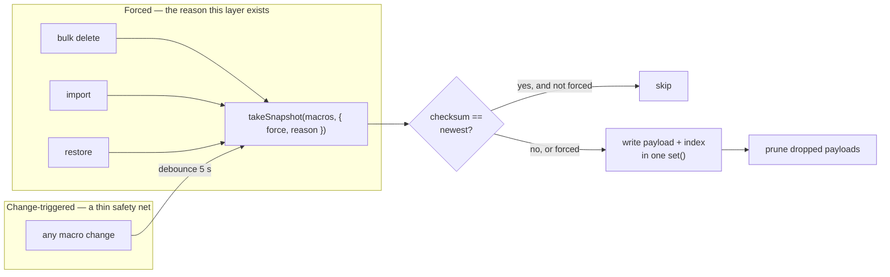
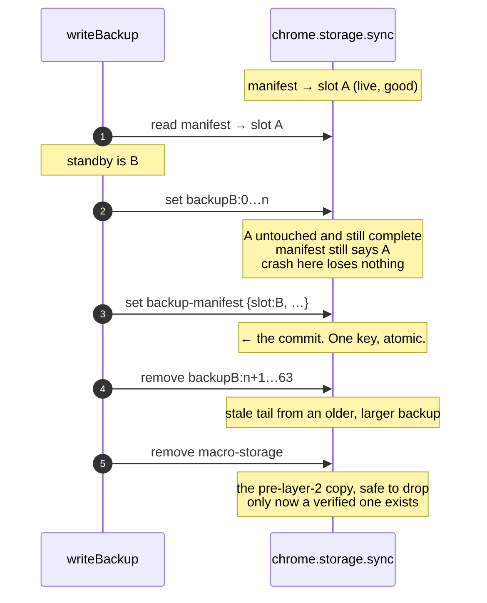
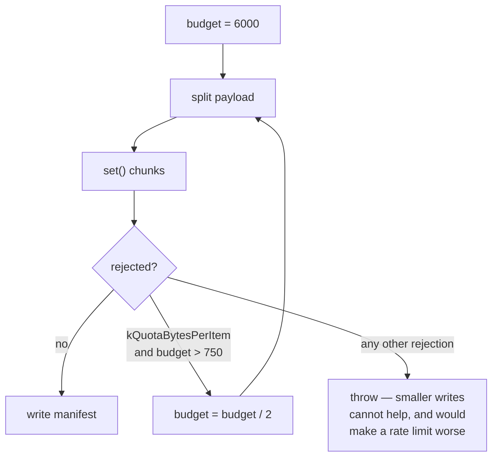
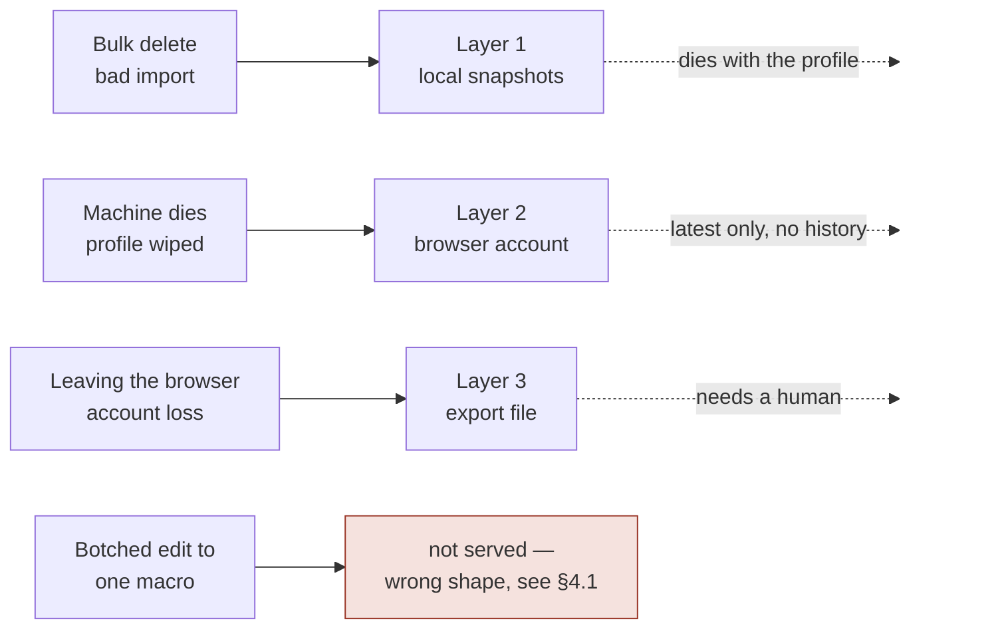

# Macro storage — design, workflow, and why

Companion to `adr/0001-macro-storage-layers.md`. The ADR records decisions in the order they were
made, including the ones later reversed. This describes the system as it now stands, and explains
the two parts that are least self-evident: **what the local snapshots are for**, and **why the
browser-account backup uses two slots**.

Status: current as of 2026-08-02.

---

## 1. The problem

A text expander holds content its user typed once and expects to have forever. Losing it is not
recoverable by any means the app provides — there is no server holding a copy. So the storage design
is mostly a question of *which ways can this be lost, and what answers each one*.

Three ways, and they are not alike:

| # | How the library is lost | Frequency | Cost | Natural shape of the fix |
|---|---|---|---|---|
| 1 | The user destroys it themselves — bulk delete, bad import | rare | total | a copy of the **whole library**, from just before |
| 2 | The machine dies, or the profile is wiped | rare | total | a copy **outside this profile** |
| 3 | An edit to one macro goes wrong while composing | frequent | trivial | the **previous value of that macro** |

The design serves 1 and 2 with a layer each. It deliberately does **not** serve 3 — see §4.1, because
that omission is the single most misunderstood thing here.

---

## 2. The whole picture

**One rule governs the whole diagram: `chrome.storage.local` is the only thing ever read back.**
Everything else is written to and read only on an explicit, user-initiated restore. Sync is never
consulted during hydration.

That rule exists because it was once violated. Reads preferred sync and fell back to local, while
writes went to local always and sync inside a swallowed `catch`. Once the state outgrew sync's
8,192-byte item cap the sync write began rejecting, its copy froze — and a frozen copy is not
`null`, so it kept winning the read. The store hydrated stale and wrote the stale state back over
the good local copy. The symptom was settings controls flickering back to old values.

---

## 3. What is stored where

### `chrome.storage.local` — the authority

| Key | Holds | Written by |
|---|---|---|
| `macro-storage` | the live library + config, as one JSON string | zustand persist |
| `macro-snapshots` | snapshot index: `{ rev, entries[] }` | `macroSnapshots.ts` |
| `macro-snapshot:<rev>` | one snapshot payload — the macro array | `macroSnapshots.ts` |
| `device-id` | a uuid, minted on first use | `deviceId.ts` |
| `last-export` | `{ at, checksum, count }` of the last export | `exportTracking.ts` |
| `macros`, `pendingOps`, `access`, `refresh` | orphans from removed features | *nothing — see §8* |

`device-id` deserves a note: **local storage does not sync, so a uuid written there is a per-device
identity by construction.** No API and no fingerprinting. The browser offers nothing better —
`identity.getProfileUserInfo()` returns the same account on every machine, and
`sessions.getDevices()` reports tab-sync data rather than anything about this extension.

### `chrome.storage.sync` — the browser account

| Key | Holds |
|---|---|
| `backup-manifest` | which slot is live, plus revision, chunk count, checksum, macro count, timestamp, device, encoding |
| `backupA:0…n` | slot A payload chunks |
| `backupB:0…n` | slot B payload chunks |
| `edit-log` | last 12 `{ at, dev, kind, n }` entries |

Hard limits, all of them the platform's: **102,400 bytes total**, **8,192 bytes per item**, 512
items, 1,800 writes/hour.

---

## 4. Layer 1 — local snapshots

### 4.1 What it is for, and what it is not for

**For:** failure 1 — the user destroys their own library. A bulk delete over a multi-select, a bad
import merged over the top.

**Not for:** failure 3 — undoing a botched edit to a single macro. This is worth stating flatly
because the feature *looks* like it should serve it and cannot: **restoring a snapshot replaces the
entire library, discarding everything done since.** To recover one macro's previous text you would
throw away every other change made in the meantime. No amount of snapshot frequency fixes that; it
is the wrong shape, not the wrong resolution.

The first design missed this. Retention was five recent, one per hour for a day, one per day for a
fortnight — sized as though this were a general-purpose history. In practice a few minutes of
ordinary editing produced six near-identical full copies, because the hourly tier was diligently
capturing failure 3, the one case it could never help with.

### 4.2 The correction: snapshot on danger, not on schedule

The earlier answer to *"we might miss the important moment"* was to snapshot more often. The better
answer is to snapshot **at** the moments that are important.

Each forced snapshot records **why**, so the list reads *"Before deleting · today 16:28 · 28
macros"* rather than a fourth identical timestamp. At the moment this list is read — someone has
just lost something — the reason is what they recognise; a timestamp is what they would have to
reason from.

Deleting is the case that had *no* forced snapshot until recently. It is the most destructive action
the app offers, it is offered over a multi-select, and it relied on whatever the debounced timer
happened to have caught beforehand.

### 4.3 Retention

Two independent mechanisms: **tiers** decide what is worth keeping, **the byte budget** decides what
survives when space runs short.

| Tier | Rule | Kept |
|---|---|---|
| `forced` | taken before a delete / import / restore | most recent **5** |
| `recent` | newest by revision | **2** |
| `daily` | newest in each calendar day | **7 days** |
| `unplaced` | timestamp unparseable or in the future | all — see below |

An entry may qualify under several rules and is labelled by the one that protects it longest.
Eviction runs the other way — **`unplaced` → `daily` → `recent` → `forced`** — oldest first within a
tier, stopping the moment the set fits.

`forced` is evicted last because a snapshot taken immediately before a delete sits at a moment no
other snapshot can reconstruct. `unplaced` goes first because those entries are kept only on the
grounds that their clock could not be trusted, which is the least defensible thing to spend space
on.

**The byte budget is 5 MB of `chrome.storage.local`'s 10 MB.** Half is deliberately left free, and
the asymmetry is the reason: losing an old snapshot is a disappointment, whereas filling the quota
breaks the write of the *live library*, which is the thing all of this exists to protect.

**A floor of 3 newest survives any budget**, taken by revision rather than timestamp so a skewed
clock cannot argue the newest snapshots out of protection. Without a floor, a library larger than
the whole budget would retain nothing — being told backups exist and finding none is worse than
never having offered them.

Net effect: **eight change-triggered writes now leave two snapshots**, not eight.

### 4.4 Why whole copies rather than diffs or per-macro history

Both were considered and priced. Content-addressing macros by hash would cut history storage by
roughly 8×, and the mechanism is small — maybe 80 lines. What is not small is the consequence:
**once snapshots share blobs, deleting one requires knowing whether any other still references its
macros.** That is mark-and-sweep. Get it wrong one way and blobs leak forever, defeating the point;
get it wrong the other and a live blob is collected, producing a snapshot that silently fails to
restore — destroying precisely the thing the feature exists to protect, discovered at the moment of
panic.

Today retention is a pure function over an array and deleting a snapshot is deleting one key.
Nothing can be half-collected. Once the count dropped from ~42 possible to 3–5 actual, the
redundancy that motivated the idea largely dissolved. **Reduce what you store before optimising how
you store it.**

### 4.5 Concurrency

`takeSnapshot` is a read-modify-write over a single index key, and `chrome.storage` offers no
transaction. Two overlapping calls both read the same index, both find their checksum different from
the same newest entry, and both write. This was observed in the wild as revisions 5 and 6 holding
byte-identical libraries.

Callers are serialised through a promise chain, which survives a rejection so one failed snapshot
cannot wedge every later one. It covers overlap **within one context**, which is where the observed
duplicates came from. Cross-context overlap — the settings page forcing one while the worker's timer
fires — is left alone deliberately: the cost is a duplicated snapshot, never a lost one, and the
cure would be the cross-device lock this design has already rejected.

---

## 5. Layer 2 — the browser-account backup

### 5.1 The substrate is hostile, and every decision here is a response to that

`chrome.storage.sync` is the only place that survives a reinstall without an account. It has three
properties that make it unsuitable for what it is being used for:

1. **An item caps at 8,192 bytes.** A macro library is bigger. → *chunking*
2. **There is no history and no transaction.** A failed or partial write has nothing to fall back
   on. → *A/B slots*
3. **Cross-device arrival order for a multi-key `set()` is undocumented.** This was researched and
   could not be settled either way. A stale chunk from two cycles ago can sit beside a fresh
   manifest. → *checksum*

### 5.2 Why two slots — the key idea

The question this document exists to answer.

**`chrome.storage.sync` gives exactly one atomic operation: writing a single key.** There is no
multi-key transaction, no compare-and-swap, no conditional write. A `set()` with four keys may land
as four separate events, in any order, on any device.

So the design uses the one atomic thing it has as a **commit pointer**:

- The library lives in **two slots**, A and B.
- The **manifest** — a single key — names which slot is live.
- A write always goes to the slot that is **not** live.
- The manifest is written **last**. That single-key write is the commit.

Everything before the manifest write is invisible; everything after is committed. There is no moment
at which the readable copy is incomplete.

**Cost:** half the quota, ~45 KB per slot. That is the trade, and it is why compression mattered.

**What the checksum adds on top.** Slot switching orders things on the *writing* device. It cannot
order them on a *receiving* one — and since arrival order is undocumented, a device may see a fresh
manifest beside a chunk that has not arrived, or a stale one that has. The manifest carries a
checksum over the macros, so:

- a missing chunk → **`incomplete`** — half-arrived, worth waiting out
- present, decodes, parses, checksum disagrees → **`corrupt`** — the stale-chunk case
- nothing at all → **`none`**

Three distinct outcomes because only one of them is worth retrying. Collapsing them into "restore
failed" would hide that.

The checksum is computed over the **macros**, never over the stored bytes. So a decoding fault lands
on the same `corrupt` outcome as a stale chunk, and compression introduced no new failure mode.

### 5.3 Chunking, and a lesson about measurement

The library is split so each piece fits an item. The interesting part is how the size was decided.

The documented rule is *"the JSON stringification of its value plus its key length"*. The first
implementation modelled that carefully — escaping charged per character, 7,800 bytes of content, key
and quotes inside the margin. It produced chunks of **7,827 and 744 UTF-8 bytes against a documented
cap of 8,192** — and Chrome rejected the write with `Resource::kQuotaBytesPerItem quota exceeded`.

Worse, the tests measured cost with `String.length`, which counts UTF-16 units rather than bytes.
**Code and tests agreed with each other about the wrong thing**, so twenty green tests coexisted with
a write that had never once succeeded.

The real accounting is stricter than the documented one in some way this code cannot derive from
outside the browser. Guessing at a second model risked the same outcome, so the write **adapts**:

Retrying is safe *because* of the standby slot: every attempt lands in the copy that is not live, so
a half-written attempt damages nothing and the next simply overwrites it. A property added for torn
writes turned out to underwrite this too.

### 5.4 Compression

Added once the ceiling was measured properly rather than assumed.

The first estimate used an average of 284 bytes per macro and concluded the limit was ~157 macros
away — no need to act. That average came from a library padded with short test entries. The real use
case is **email notification templates**, which run 1,100+ bytes each, because every HTML macro
stores `text` and `html` side by side as near-duplicates. **A slot fills at roughly 38 of them.**

- gzip via the platform's `CompressionStream`, then base64.
- **Native, not a library.** A backup has to be decodable by whatever version is installed when
  someone finally needs it, possibly after a reinstall on a new machine. A bundled compressor is a
  version to drift.
- **base64 for two reasons.** `chrome.storage` values must survive a JSON round trip, which binary
  strings do not. And base64 is pure ASCII — no quotes to escape, no multi-byte characters, no
  surrogate pairs — so a chunk's stringified size is exactly its length plus two. It is the one
  place in this system where the quota became predictable.
- The manifest records its `encoding`, and one without an encoding reads as plain. **Backups written
  before compression keep restoring** — a backup is the one thing that cannot have a flag day.
- "Unchanged" means content *and* encoding match what would be written now, so an older encoding is
  itself a reason to rewrite. Otherwise a user who never edits again would never receive the
  migration.

Measured on the real library: **3.03×** (8,218 bytes → 2,708 characters). On template-shaped content
it reaches 11–15× synthetically; **5–10× is the honest expectation**, and the template case is
precisely the one that was going to hit the ceiling.

### 5.5 Debounce

The backup is debounced by **one minute, on a `chrome.alarms` alarm — never a `setTimeout`.** An MV3
service worker is torn down when idle and takes pending timers with it, so a one-minute timeout
would simply never fire and the backup would silently not happen. Creating an alarm with a name that
already exists replaces it, so rescheduling *is* the debounce, with no bookkeeping.

(The snapshot watcher's 5-second `setTimeout` is fine: the change event that schedules it has already
reset the worker's idle countdown, and 5 s clears comfortably. A minute does not.)

Restore stays **explicit**, and there is also a manual **"back up now"**. That button is worth having
on its own terms — someone about to wipe a machine should not have to trust a timer — and it is the
only path by which a sync write's failure reaches the person it affects. Everything automatic runs
in the service worker, where a rejection reaches a console nobody has open. A backup that had never
once succeeded still reported "not backed up yet" without ever explaining itself.

---

## 6. Layer 3 — export, and the nudge

A JSON file the user downloads. The only copy that survives leaving the browser ecosystem entirely,
and the only one that works signed out or on Firefox Android. Import merges by command; duplicates
are skipped, and a forced snapshot is taken first.

Its one weakness is that it depends on somebody remembering, which is closed by a **nudge**:
*"37 changes since your last export, 2 Aug."* Compared **by checksum, not by count** — the commonest
drift is a macro *edited* rather than added or removed, which leaves the total identical. Tracked in
**local** storage rather than sync, because "when did *this* machine last export" is the question
worth answering: a file exported on the laptop is not on the desktop.

The nudge only ever appears to someone who has exported at least once. Prompting a user who never
has would be advertising a feature rather than warning about a gap.

---

## 7. The edit log

`{ at, dev, kind, n }`, last 12 entries, **in its own sync key**.

It replaced a rejected design: enforcing single-device ownership, where a newer sign-in takes the
library and older devices go read-only. That needs a lease; a lease needs a coordinator; and
`chrome.storage.sync` cannot be one — no compare-and-swap, no conditional write, and propagation
both delayed and unordered, so two devices can each read "unheld" and each conclude they hold it.
The split-brain window is however long a laptop stays shut.

What the lease was reaching for was *information at the moment two libraries meet* — and that moment
is already gated behind an explicit restore. So the log records changes instead of forbidding them,
and the restore prompt can say *"last changed on another device"* rather than asking someone to
overwrite a library sight unseen.

Its own key, not inside the payload: separate items carry separate 8,192-byte budgets and the
512-item limit is nowhere near, so it never competes with the library for room — **and it stays
readable when the payload write is the thing that failed**, which is exactly when someone needs to
know what happened.

The diff comes from `storage.onChanged`'s `oldValue`, so nothing has to be remembered across a
service-worker suspension to produce it.

---

## 8. Failure coverage

**No layer substitutes for another.** Snapshots hold history but die with the profile. The browser
account survives a reinstall but holds only the latest state — so a mistake that syncs before the
device is lost is not recoverable from it. The export file survives everything and requires a human.

---

## 9. Deliberately not built

| Idea | Why not |
|---|---|
| Per-record sync with merge | Needs tombstones and tombstone GC. The time-based answer is a known footgun — Cassandra's `gc_grace_seconds` resurrects deleted data on a node offline longer than it. A text expander is not edited from two devices at once. |
| Single-device lease | Needs a coordinator sync cannot provide. And exclusion is not durability: locking a device out creates no copy. |
| Content-addressed snapshots | ~8× on history, at the cost of reference counting whose failure mode is a silently unrestorable backup. See §4.4. |
| IndexedDB for snapshots | Answers a quota question the 5 MB budget already answers. Does not touch redundancy or shape. |
| Dropping `text` from HTML macros in the backup | ~1.35× for free — but `macroStorage.ts` holds the rule *a backup that reshapes its input is not a backup*, written after that exact mistake once dropped `updated_at`. |
| `unlimitedStorage` | Moves the wall rather than removing it. |
| A hosted backend | Accounts, GDPR, support load — in exchange for something the browser already does, for a tool whose pitch is that it sees everything you type and keeps none of it. |

The orphaned local keys (`macros`, `pendingOps`, `access`, `refresh`) are left in place on purpose.
`pendingOps` can carry macro content from queued creates, so removing it is a data deletion and
should be a decision rather than a side effect.

---

## 10. Numbers, as measured

| | |
|---|---|
| Library (28 macros, mixed) | 7,984 bytes |
| Same, gzip + base64 | 2,708 chars — **3.03×** |
| Both sync slots together | 5,300 chars of 102,400 |
| HTML macro, average | 577 bytes |
| Email-template macro | ~1,180 bytes |
| Slot ceiling, uncompressed | ~38 templates |
| Slot ceiling, compressed | several hundred |
| Snapshots after 8 change-triggered writes | 2 |
| Snapshot budget | 5 MB of 10 MB |

---

## 11. Prior art, and what is unusual here

Of three extensions examined, **none keeps a local version history.** Briskine requires an account
and recovers from Firestore. Stylus delegates cross-device to Dropbox/Drive/WebDAV. AutoTextExpander
stores one item per shortcut in sync with no history at all.

Chrome's own guidance says `storage.sync` is for "preserving user settings", and on the
chromium-extensions list Chrome DevRel is blunter: **treat sync as a cache rather than authoritative
storage.**

This design agrees with that and works within it. Sync is never read during hydration, restore is
always explicit and always confirmed, and every read is checksum-validated. The chunking and
compression are not an attempt to make sync into a database — they are what makes a *best-effort
convenience* hold a realistic library instead of an unrealistic one. The line that is not crossed is
**reliance**: if the browser account is empty, absent, or over quota, nothing else in the system
degrades.
