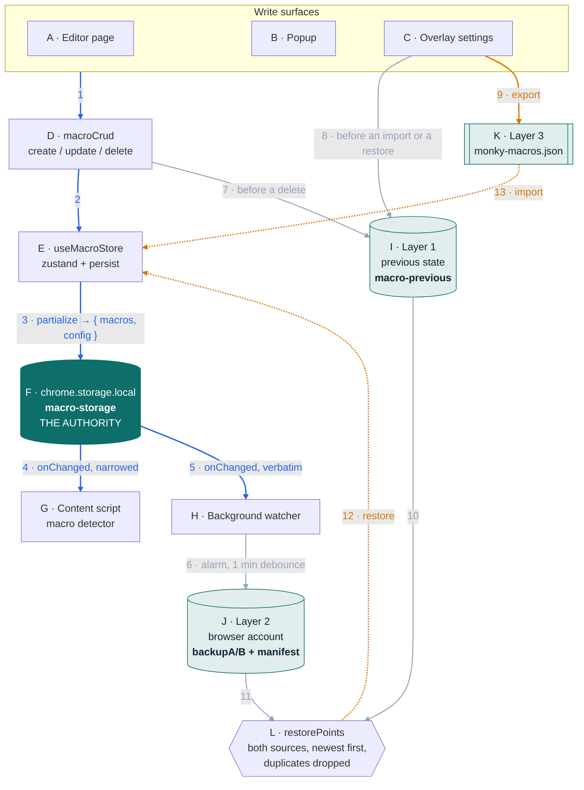
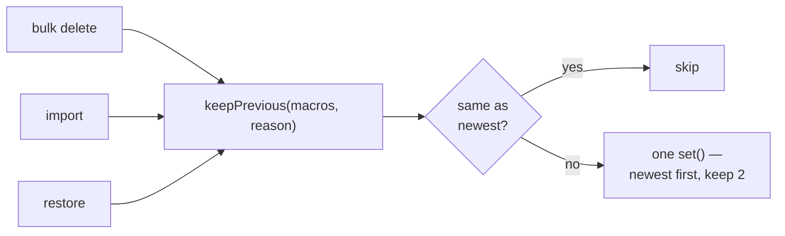
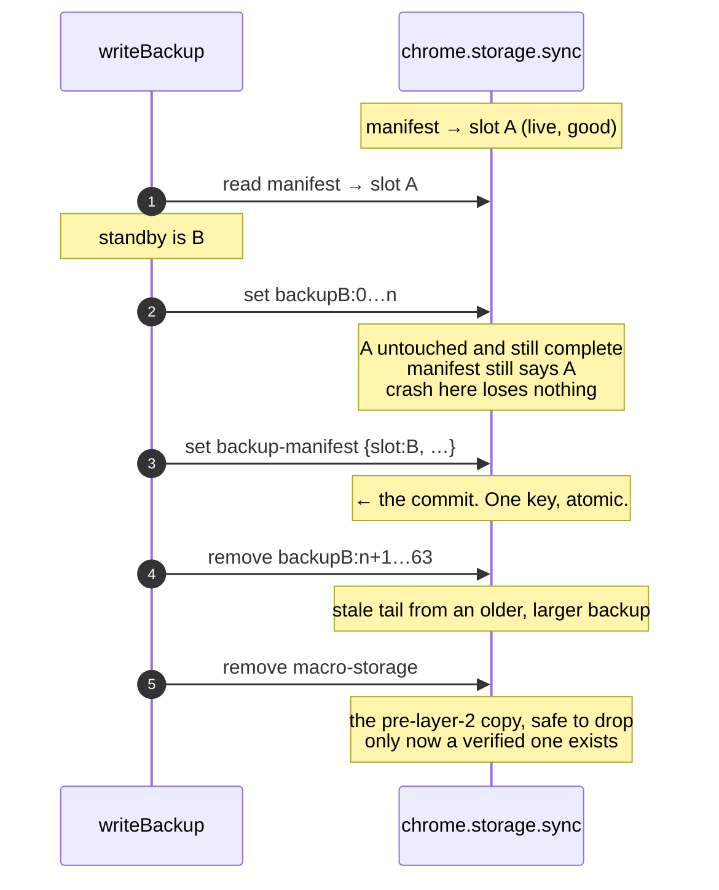
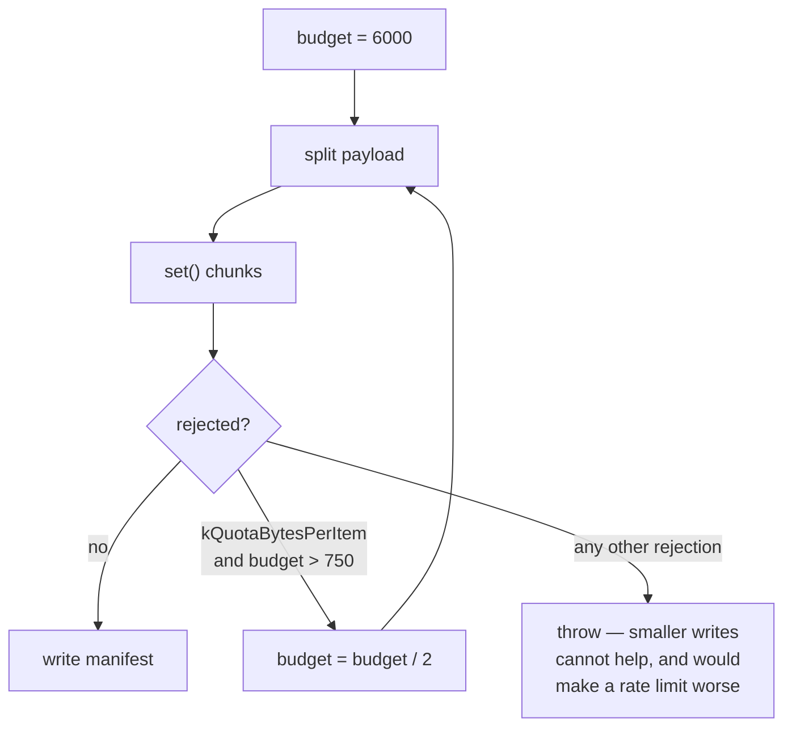
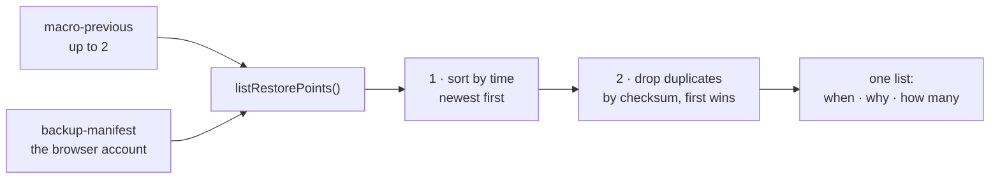
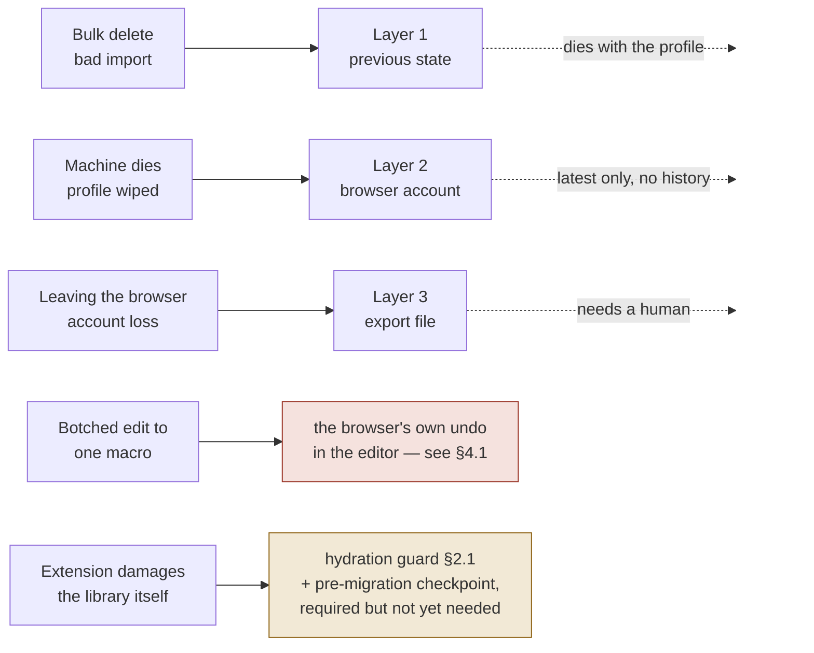

# Macro storage — design, workflow, and why

Companion to `adr/0001-macro-storage-layers.md`. The ADR records decisions in the order they were
made, including the ones later reversed. This describes the system as it now stands, and explains
the two parts that are least self-evident: **what the local copies are for**, and **why the
browser-account backup uses two slots**.

Status: current as of 2026-08-04.

---

## 1. The problem

A text expander holds content its user typed once and expects to have forever. Losing it is not
recoverable by any means the app provides — there is no server holding a copy. So the storage design
is mostly a question of *which ways can this be lost, and what answers each one*.

Three ways, and they are not alike:

| # | How the library is lost | Frequency | Cost | Natural shape of the fix |
|---|---|---|---|---|
| 1 | The user destroys it themselves — bulk delete, bad import | rare | total | a copy of the **whole library**, from just before |
| 2 | The machine dies, or the profile is wiped | rare | total | a copy **outside this profile** |
| 3 | An edit to one macro goes wrong while composing | frequent | trivial | the **previous value of that macro** |
| 4 | **The extension damages the library itself** — unreadable bytes, a faulty migration, a bad release | rare | total | a copy from **before the code ran**, and a refusal to overwrite what it cannot read |

The design serves 1 and 2 with a layer each. **3 is served by the browser's own undo inside the
content editor and by nothing else here** — see §4.1. That boundary is the single most misunderstood
thing in this design, and it was got wrong once already.

**4 is the one added last**, after a review pointed out that a mistake made by the *extension* is not
covered by copies taken before the *user* does something. Half of it is answered (§2.1, the hydration
guard); the other half is a standing requirement rather than code, because the migration it guards
does not exist yet (§5.4).

---

## 2. The whole picture

Elements are lettered and arrows numbered so they can be referred to precisely. **Colour groups the
arrows by what set them in motion**, and both keys follow the diagram.

| Colour | Arrows | What it means |
|---|---|---|
| 🔵 **blue** | 1–5 | **one editing action and everything it causes.** The user created, edited or deleted a macro; the rest follows without another decision. |
| ⚪ **grey** | 6, 7, 8, 10, 11 | **copies the extension makes for itself**, and the reads that gather them. Nobody asks for these. |
| 🟠 **orange** | 9, 12, 13 | **a deliberate act on the whole library.** These are the only ones a person chooses. |

**Elements**

| | Element | What it is |
|---|---|---|
| **A** | Editor page | Full-page macro editor, `src/editor/` |
| **B** | Popup | Quick add, site toggle |
| **C** | Overlay settings | In-page settings, import/export, recovery |
| **D** | `macroCrud` | create / update / delete; stamps `updated_at`; synchronous |
| **E** | `useMacroStore` | Zustand + persist, key `macro-storage` |
| **F** | `chrome.storage.local` | **The authority — the only thing ever read back** |
| **G** | Macro detector | Content script; reads through `toMacros`, narrowed to what matching needs |
| **H** | Background watcher | Service worker; reads the stored array verbatim |
| **I** | `macro-previous` | Layer 1 — the last 2 libraries, each from before a destructive act (§4) |
| **J** | Browser account | Layer 2 — chunked, compressed, A/B slots (§5). Requires no *Monky* account; it does require the user's browser sync account and settings |
| **K** | Export file | Layer 3 — the only copy that leaves the browser (§7) |
| **L** | `restorePoints` | Combines I and J into one list **ordered by time, newest first**, then drops duplicates. Not local-first — a browser-account copy newer than a local one sorts above it. Which source a point came from is not something the reader has to reason about (§6) |

**Arrows**

| | From → to | Trigger | Notes |
|---|---|---|---|
| 🔵 **1** | A/B/C → D | a user action | every surface writes through the same path |
| 🔵 **2** | D → E | immediate | the store is the single source of truth |
| 🔵 **3** | E → F | every change | `partialize` decides what is worth persisting |
| 🔵 **4** | F → G | `storage.onChanged` | narrowed to the six fields expansion needs |
| 🔵 **5** | F → H | `storage.onChanged` | verbatim — a backup must not reshape its input |
| ⚪ **6** | H → J | alarm, 1-minute debounce | an alarm, not a timer: see §5.5 |
| ⚪ **7** | D → I | **before** a delete | `macroCrud.deleteMacros` |
| ⚪ **8** | C → I | **before** an import or a restore | those two do not pass through `macroCrud` |
| 🟠 **9** | C → K | explicit | leaves the sandbox, so it is never automatic |
| ⚪ **10** | I → L | on opening the list | a read; changes nothing |
| ⚪ **11** | J → L | on opening the list | a read; changes nothing |
| 🟠 **12** | L → E | **explicit + confirmed** | replaces the live library; keeps its own way back first, via arrow 8 |
| 🟠 **13** | K → E | **explicit** | *merges*, it does not replace — see below |

Three things the colouring makes visible that prose had to assert:

**Blue is one causal chain, not five decisions.** A single edit produces 1 → 2 → 3, and 4 and 5 follow
from the same storage event. Nothing between them is a choice.

**The orange arrows are exactly the three the rule in §6 names** — 9 leaves the browser sandbox, 12
replaces the live library, 13 merges into it. Every grey and blue arrow stays inside the extension's
own storage and is additive, which is what lets it happen unattended.

**Grey 7 and 8 do the same job from different places, and that is not an accident of drawing.** A
delete goes through `macroCrud`; an import and a restore do not, so each keeps the previous state
itself. Drawing them as one arrow out of D — which an earlier version of this diagram did — asserted
a code path that does not exist.

The two dotted arrows, **12** and **13**, encode something else again: they are the only ones that
flow data *back into* the store rather than out of it.

**One rule governs the whole diagram: `chrome.storage.local` (F) is the only source used to hydrate
normal application state.** The other stores are read too — that is what recovery is — but only on an
explicit, user-initiated restore, never at startup. "The only thing ever read back" was the earlier
wording and it was wrong twice over: `macro-previous` and the browser copy are both read.

### 2.1 What happens when the authority itself is unreadable

The rule above says the live library is the only thing hydration reads. It does not say what happens
when that read fails — and the answer used to be the worst one available.

A single truncated value made `JSON.parse` throw inside the persist middleware, which left the store
at its seeded defaults: seven demo macros. **The next ordinary edit then wrote those demos over the
bytes that had failed to parse.** A string a person could very likely have repaired by hand,
destroyed silently, by one bad byte. This was measured, not feared.

It is the same shape as the bug that produced the rule in the first place — something that is not the
authority winning, and overwriting what is — reappearing one layer down inside the module written to
fix it.

The adapter now separates **absent** from **unreadable**:

- **Absent** → a first run. Seed the samples, as before.
- **Unreadable** → copy the bytes to `macro-storage-unreadable` and hydrate an **empty** library.

Empty is the load-bearing part. Returning null lets the store fall back to the demos, and the demos
are what get written over the original. Empty is also the honest answer: we do not know what was
there, and presenting samples would look like a fresh install and invite someone to type over their
own data. Recovery still works, so `macro-previous` and the browser copy remain reachable.

Only the **first** failure is quarantined. A later, more damaged value must not replace the copy
closest to the good data.

That rule exists because it was once violated. Reads preferred sync and fell back to local, while
writes went to local always and sync inside a swallowed `catch`. Once the state outgrew sync's
8,192-byte item cap the sync write began rejecting, its copy froze — and a frozen copy is not
`null`, so it kept winning the read. The store hydrated stale and wrote the stale state back over
the good local copy. The symptom was settings controls flickering back to old values.

---

## 3. What is stored where

### `chrome.storage.local` — the authority

| Key | Holds | Written by |
|---|---|---|
| `macro-storage` | the live library + config, as one JSON string | zustand persist |
| `macro-previous` | the last **2** libraries, each from just before a destructive act | `macroPrevious.ts` |
| `backup-health` | how the last browser-account copy went | `backupHealth.ts` |
| `macro-storage-unreadable` | the bytes of a library that would not parse, kept once (§2.1) | `useMacroStore.ts` |
| `device-id` | a uuid, minted on first use | `deviceId.ts` |
| `last-export` | `{ at, checksum, count }` of the last export | `exportTracking.ts` |
| `macros`, `pendingOps` | orphans that may hold macro content — left in place on purpose (§10) | *nothing* |

`device-id` deserves a note: **local storage does not sync, so a uuid written there is a per-device
identity by construction.** No API and no fingerprinting. The browser offers nothing better —
`identity.getProfileUserInfo()` returns the same account on every machine, and
`sessions.getDevices()` reports tab-sync data rather than anything about this extension.

### `chrome.storage.sync` — the browser account

| Key | Holds |
|---|---|
| `backup-manifest` | which slot is live, plus revision, chunk count, checksum, macro count, timestamp, device, encoding, **schema**, and **`previous`** — enough about the generation it replaced to read and validate it (§5.2) |
| `backupA:0…n` | slot A payload chunks |
| `backupB:0…n` | slot B payload chunks |
| `edit-log` | last 12 `{ at, dev, kind, n }` entries |

Hard limits, all of them the platform's: **102,400 bytes total**, **8,192 bytes per item**, 512
items, 1,800 writes/hour.

---

## 4. Layer 1 — the previous state

### 4.1 What it is for, and what it is not for

**For:** failure 1 — the user destroys their own library. A bulk delete over a multi-select, a bad
import merged over the top.

**Not for:** failure 3 — undoing a botched edit to a single macro. Worth stating flatly, because this
looks like it should serve that and cannot: **restoring replaces the entire library, discarding
everything done since.** To recover one macro's previous text you would throw away every other change
made in the meantime. That is the wrong shape, not the wrong resolution, and no amount of frequency
fixes it. Composing is served by the browser's own undo inside the content editor, which is free,
already works, and is not this layer's business.

### 4.2 What this replaced, and why

The first version was a browsable history: five recent copies, one per hour for a day, one per day
for a fortnight, with retention tiers, an eviction order, calendar bucketing, a five-megabyte budget
and a serialisation queue — about 1,300 lines. It was the wrong shape twice over.

It could not serve failure 3, as above. And the history it *did* keep leaked into the interface as a
list of near-identical rows, which a person who had just lost something had to decode before they
could choose one. A few minutes of ordinary editing produced six of them, because the hourly tier was
diligently capturing the one case it could never help with.

Two corrections, in order:

1. **Trigger on danger, not on schedule.** Snapshot *at* the moments that matter rather than often
   enough to hope to catch one. Deleting — the most destructive act the app offers — had no such
   capture at all and relied on whatever a debounced timer happened to have caught.
2. **Then: if the trigger is a handful of moments, the history is a handful of copies.** Once that
   was true, every tier, budget and bucket existed to manage something that no longer accumulated.

What is left is one key holding the last **two** libraries, each written immediately before a
destructive act and never on an ordinary edit. That last part is what keeps it useful: the realistic
way a bulk delete is discovered in a text expander is typing a macro weeks later and getting nothing,
and a copy that moved on every edit would have been overwritten long before.

**Why two rather than one:** delete-then-import would otherwise leave only the pre-import state,
having lost the pre-delete one to it. Two costs a second copy and no policy — keep the newest two.

**Why that is not the reason sync uses two slots.** There, a second slot exists because a write can
tear or half-propagate and must not damage the readable copy. A single-key `chrome.storage.local.set`
is atomic, so here the second entry buys depth and nothing else. The symmetry is a coincidence worth
naming, so it does not imply a shared justification.

### 4.3 The interface, which was the real defect

The list was the problem more than the storage. A list asks *"which one?"*, which requires a mental
model of retention tiers nobody should have to hold. And there were **two** of them — local history
and browser-account backup, each with its own Restore button, sourced from different storage, with
nothing to say which one a person in trouble wanted. That is worse than having one, and arguably
worse than having none.

So recovery is now one list, and the source is not a category the user reasons about — see §6.

## 5. Layer 2 — the browser-account backup

### 5.1 The substrate is hostile, and every decision here is a response to that

`chrome.storage.sync` is the only place that survives a reinstall without a **Monky** account — it
does depend on the user's browser sync account being present and enabled, which is a distinction
worth keeping: "no account" is not true, "no account of ours" is. It has three
properties that make it unsuitable for what it is being used for:

1. **An item caps at 8,192 bytes.** A macro library is bigger. → *chunking*
2. **There is no history and no transaction.** A failed or partial write has nothing to fall back
   on. → *A/B slots*
3. **Cross-device arrival order for a multi-key `set()` is undocumented.** This was researched and
   could not be settled either way. A stale chunk from two cycles ago can sit beside a fresh
   manifest. → *checksum*

### 5.2 Why two slots — the key idea

The question this document exists to answer.

**`chrome.storage.sync` gives exactly one atomic operation: writing a single key.** There is no
multi-key transaction, no compare-and-swap, no conditional write. A `set()` with four keys may land
as four separate events, in any order, on any device.

So the design uses the one atomic thing it has as a **commit pointer**:

- The library lives in **two slots**, A and B.
- The **manifest** — a single key — names which slot is live.
- A write always goes to the slot that is **not** live.
- The manifest is written **last**. That single-key write is the commit.

Everything before the manifest write is invisible; everything after is committed.

**That claim holds for one writer.** It was previously stated without the qualifier, and the
qualifier is load-bearing. Two devices backing up within the same minute both read "A is live", both
choose B, and interleave their chunks there. The checksum catches the mixture — but detection is not
recovery, and for a while the design stopped at detection: the manifest pointed at a broken slot
while a complete, valid generation sat untouched in the other one, unreachable because nothing
recorded how long it was or what it should checksum to.

So the manifest now carries a **`previous`** description of the generation it replaced, and a
corrupt live slot falls back to it:

- live slot valid → use it.
- live slot **incomplete** → say so, and stop. Propagation is still in flight; handing back an older
  library nobody asked for is worse than asking them to wait a moment.
- live slot **corrupt** → read and fully validate `previous`; use it if it stands, and report it
  *described as itself*, so the list shows when that copy was made rather than the timestamp of the
  one that failed.
- neither → corrupt.

The honest statement of the guarantee is therefore: **A/B publication protects against an
interrupted or partly-propagated write from a single logical writer, and the checksum plus the
fallback turn cross-device interference into the loss of one generation rather than the loss of the
backup.**

**Cost:** half the quota, ~45 KB per slot. That is the trade, and it is why compression mattered.

**What the checksum adds on top.** Slot switching orders things on the *writing* device. It cannot
order them on a *receiving* one — and since arrival order is undocumented, a device may see a fresh
manifest beside a chunk that has not arrived, or a stale one that has. The manifest carries a
checksum over the macros, so:

- a missing chunk → **`incomplete`** — half-arrived, worth waiting out
- present, decodes, parses, checksum disagrees → **`corrupt`** — the stale-chunk case
- nothing at all → **`none`**

Three distinct outcomes because only one of them is worth retrying. Collapsing them into "restore
failed" would hide that.

The checksum is computed over the **macros**, never over the stored bytes. So a decoding fault lands
on the same `corrupt` outcome as a stale chunk, and compression introduced no new failure mode.

**A checksum is an integrity check, not a validity check.** It proves the bytes are the bytes that
were written; it says nothing about whether they are a usable library. Duplicate ids, a macro with
no command, or a record from a future release all checksum perfectly and would then replace a
working library with something the rest of the code cannot address. So every route into the store —
the browser copy, the local previous states, and an imported file — passes through one
`validateLibrary`, and a shape one path rejects cannot arrive through another.

Duplicate **ids** are refused: `updateMacro` and `deleteMacros` both address a macro by id, so two
records sharing one is a library where those operations are undefined. Duplicate **commands** are
tolerated — they degrade matching, which the editor surfaces and the user can fix, and refusing an
entire recovery over one is the wrong trade at the moment somebody is trying to get their work back.

Both envelopes also record the **schema** they were written under, and a copy from a newer release is
refused rather than guessed at. There is no migration path yet because there has been no migration;
when one is added, ADR 0001 records that a `keepPrevious` checkpoint must be taken before it runs —
a faulty migration is the one failure that transforms the authority *and* gets faithfully copied to
the browser account a minute later.

### 5.3 Chunking, and a lesson about measurement

The library is split so each piece fits an item. The interesting part is how the size was decided.

The documented rule is *"the JSON stringification of its value plus its key length"*. The first
implementation modelled that carefully — escaping charged per character, 7,800 bytes of content, key
and quotes inside the margin. It produced chunks of **7,827 and 744 UTF-8 bytes against a documented
cap of 8,192** — and Chrome rejected the write with `Resource::kQuotaBytesPerItem quota exceeded`.

Worse, the tests measured cost with `String.length`, which counts UTF-16 units rather than bytes.
**Code and tests agreed with each other about the wrong thing**, so twenty green tests coexisted with
a write that had never once succeeded.

The real accounting is stricter than the documented one in some way this code cannot derive from
outside the browser. Guessing at a second model risked the same outcome, so the write **adapts**:

Retrying is safe *because* of the standby slot: every attempt lands in the copy that is not live, so
a half-written attempt damages nothing and the next simply overwrites it. A property added for torn
writes turned out to underwrite this too.

### 5.4 Compression

Added once the ceiling was measured properly rather than assumed.

The first estimate used an average of 284 bytes per macro and concluded the limit was ~157 macros
away — no need to act. That average came from a library padded with short test entries. The real use
case is **email notification templates**, which run 1,100+ bytes each, because every HTML macro
stores `text` and `html` side by side as near-duplicates. **A slot fills at roughly 38 of them.**

- gzip via the platform's `CompressionStream`, then base64.
- **Native, not a library.** A backup has to be decodable by whatever version is installed when
  someone finally needs it, possibly after a reinstall on a new machine. A bundled compressor is a
  version to drift.
- **base64 for two reasons.** `chrome.storage` values must survive a JSON round trip, which binary
  strings do not. And base64 is pure ASCII — no quotes to escape, no multi-byte characters, no
  surrogate pairs — so a chunk's stringified size is exactly its length plus two. It is the one
  place in this system where the quota became predictable.
- The manifest records its `encoding`, and one without an encoding reads as plain. **Backups written
  before compression keep restoring** — a backup is the one thing that cannot have a flag day.
- "Unchanged" means content *and* encoding match what would be written now, so an older encoding is
  itself a reason to rewrite. Otherwise a user who never edits again would never receive the
  migration.

Measured on the real library: **3.03×** (8,218 bytes → 2,708 characters). On template-shaped content
it reaches 11–15× synthetically; **5–10× is the honest expectation**, and the template case is
precisely the one that was going to hit the ceiling.

### 5.5 Debounce

The backup is debounced by **one minute, on a `chrome.alarms` alarm — never a `setTimeout`.** An MV3
service worker is torn down when idle and takes pending timers with it, so a one-minute timeout
would simply never fire and the backup would silently not happen. Creating an alarm with a name that
already exists replaces it, so rescheduling *is* the debounce, with no bookkeeping.

(The snapshot watcher's 5-second `setTimeout` is fine: the change event that schedules it has already
reset the worker's idle countdown, and 5 s clears comfortably. A minute does not.)

Restore stays **explicit**. The backup half is entirely automatic, and how it went is reported
passively rather than on request — see §6.

---

## 6. Recovery, as one list

The source of a restore point is **not** something the user reasons about. A restore point is a
*moment* — when it was and why it exists — and the storage behind it never reaches the screen.

This merges cleanly rather than papering over a conflict, because **the two sources are almost never
both meaningful at once**. The browser-account copy holds the latest state, so on a working machine
it is what you already have; it becomes the only thing that matters at the moment the local data is
gone — which is exactly when the local entries do not exist either.

**The order is time, not source.** Both places are poured into one list and sorted newest first;
nothing is preferred for being local or for being the backup. A browser-account copy written after
your last delete sorts above the state kept before it, because that is the truth about when each one
was made.

**De-duplication runs after the sort, so the newer of two identical states survives.** That matters
because the timestamp is what the user chooses by: when both sources hold the same library, the row
they see is dated when that state was most recently captured, not when the older of the two copies
happened to be written.

**De-duplication is between entries, never against the current library.** An earlier draft hid the
browser copy whenever it matched what was loaded — nearly always — and produced a backup with no
visible way to restore from it and no way to check that it works. Restoring a copy identical to the
current one is a harmless no-op, and being able to do it is the only proof the thing functions. **A
backup you cannot exercise is a promise rather than a fact.**

**Hide the mechanism, keep the meaning.** "Slot B", "chunk", "manifest" are mechanism and are gone.
*From another device* is meaning — restoring a state another machine produced is materially
different from restoring your own — and stays.

### What is explicit and what is not

| operation | automatic? | why |
|---|---|---|
| copy → browser account | **automatic** | additive; writing a copy destroys nothing |
| copy → previous state | **automatic** | same, and it must happen *before* you act, so it cannot wait |
| export → file | **explicit** | leaves the browser sandbox and lands on your disk |
| **restore ← anywhere** | **explicit, always** | replaces the live library |

> **Writes that stay inside the extension's own storage can be automatic. Anything that materially
> changes the whole library, or anything that leaves the sandbox, is explicit and keeps a recovery
> point first.**

An earlier wording said *destroys or replaces*, which quietly mis-described import. Restore and
import are not the same operation and should not be collapsed:

- **Restore** *replaces* the library with a chosen earlier state.
- **Import** *merges* a file into it, skipping macros whose `command` already exists.
- **Export** copies the library out, changing nothing.

Import keeps a recovery point for the same reason restore does — it is one broad, hard-to-unpick
mutation — but calling it destructive was wrong, and the distinction matters because a merge has a
duplicate policy and a replacement does not. Monky's is **by command**: an incoming macro whose
command already exists is skipped, and the existing one is left untouched.

A restore is itself destructive, so it keeps its own way back before it runs — otherwise recovering
to the wrong moment would be the one act in the app with no undo.

### The health line is a sentence, not a control

There was briefly a **back up now** button. It existed for one good reason: everything automatic runs
in the service worker, where a rejection reaches a console nobody has open, and a backup that had
never once succeeded still reported only "not backed up yet". Pressing it was the only way to see the
error.

But it contradicted the rule above — an explicit write beside a claim that writes are automatic — and
**a failure you have to think to press a button to discover is a worse design than one that simply
tells you.** So every attempt records its outcome in `backup-health`, and the line under the list
states it, becoming the error when there is one.

**The line describes the library, not the last attempt**, and the difference is a lie the first
version could tell. A backup succeeds; the user edits three macros; the alarm has not fired yet — and
a sentence derived from the last outcome alone says *protected* about a library that is not. So the
state is computed from the live library's checksum against the committed copy's:

| state | meaning |
|---|---|
| **ok** | the committed copy *is* the library on this device |
| **pending** | the library has moved on; a backup is scheduled |
| **never** | nothing committed yet |
| **failed** | the platform refused, and the message says how |
| **too-large** | the library no longer fits the quota — a standing condition, not a blip |

`pending` is the state that was missing and it is the common one: for a minute after every edit, the
honest answer is "copying your latest changes".

> *No se pudo copiar: tus macros ya no caben en tu cuenta del navegador (48 KB).*

What is lost is forcing a backup before wiping a machine. With a one-minute debounce and a line that
says *al día*, waiting is not a hardship.

---

## 7. Layer 3 — export, and the nudge

A JSON file the user downloads. The only copy that survives leaving the browser ecosystem entirely,
and the only one that works signed out or on Firefox Android. Import merges by command; duplicates
are skipped, and a forced snapshot is taken first.

Its one weakness is that it depends on somebody remembering, which is closed by a **nudge**:
*"37 changes since your last export, 2 Aug."* Compared **by checksum, not by count** — the commonest
drift is a macro *edited* rather than added or removed, which leaves the total identical. Tracked in
**local** storage rather than sync, because "when did *this* machine last export" is the question
worth answering: a file exported on the laptop is not on the desktop.

The nudge only ever appears to someone who has exported at least once. Prompting a user who never
has would be advertising a feature rather than warning about a gap.

---

## 8. The edit log

`{ at, dev, kind, n }`, last 12 entries, **in its own sync key**.

It replaced a rejected design: enforcing single-device ownership, where a newer sign-in takes the
library and older devices go read-only. That needs a lease; a lease needs a coordinator; and
`chrome.storage.sync` cannot be one — no compare-and-swap, no conditional write, and propagation
both delayed and unordered, so two devices can each read "unheld" and each conclude they hold it.
The split-brain window is however long a laptop stays shut.

What the lease was reaching for was *information at the moment two libraries meet* — and that moment
is already gated behind an explicit restore. So the log records changes instead of forbidding them,
and the restore prompt can say *"last changed on another device"* rather than asking someone to
overwrite a library sight unseen.

Its own key, not inside the payload: separate items carry separate 8,192-byte budgets and the
512-item limit is nowhere near, so it never competes with the library for room — **and it stays
readable when the payload write is the thing that failed**, which is exactly when someone needs to
know what happened.

The diff comes from `storage.onChanged`'s `oldValue`, so nothing has to be remembered across a
service-worker suspension to produce it.

---

## 9. Failure coverage

**No layer substitutes for another.** The previous state is recent and dies with the profile. The
browser account survives a reinstall and offers one state — so a mistake that syncs before the device
is lost is not recoverable from it. (Physically it also retains the previous generation in the
standby slot, but that is an implementation fallback for a corrupt live slot, per §5.2, not a second
entry anyone is offered.) The export file survives everything and requires a human.

---

## 10. Deliberately not built

| Idea | Why not |
|---|---|
| Per-record sync with merge | Needs tombstones and tombstone GC. The time-based answer is a known footgun — Cassandra's `gc_grace_seconds` resurrects deleted data on a node offline longer than it. A text expander is not edited from two devices at once. |
| Single-device lease | Needs a coordinator sync cannot provide. And exclusion is not durability: locking a device out creates no copy. |
| A browsable snapshot history | Built, then removed. It could not serve the case people reach for, and its list was a worse interface than none. ~1,300 lines. |
| Content-addressed history | ~8× on storage, at the cost of reference counting whose failure mode is a silently unrestorable backup. Moot once the history is two copies. |
| Per-macro version history | Can version the elements, but cannot answer the question being asked: "what did my library look like" is a property of the whole ordered set, including which macros existed. Deleted ones have no key to hang history from. |
| Persistent editor undo | The browser's undo stack is opaque — no API reads, serialises or restores it — so persisting it means replacing it with a worse one, to serve the cheapest failure. |
| Undo/redo over CRUD | Genuinely attractive: linear time travel, and the user need not know what caused each step. Parked pending an interface, not rejected. |
| IndexedDB | Answers a quota question that two copies do not raise. |
| Dropping `text` from HTML macros in the backup | ~1.35× for free — but `macroStorage.ts` holds the rule *a backup that reshapes its input is not a backup*, written after that exact mistake once dropped `updated_at`. |
| `unlimitedStorage` | Moves the wall rather than removing it. |
| A hosted backend | Accounts, GDPR, support load — in exchange for something the browser already does, for a tool whose pitch is that it sees everything you type and keeps none of it. |

`macros` and `pendingOps` are left in place on purpose: both can carry macro content — `pendingOps`
from creates that never reached the network — so removing them is a data deletion and should be a
decision rather than a side effect of an upgrade.

`access` and `refresh` **are** removed, once, at startup. They held bearer tokens for the withdrawn
backend, and the reasoning that protects the other two does not reach them: credential material for a
service that no longer exists is a secret kept by accident, not data someone might want back. One
policy had been applied to all four keys and only two ever deserved it.

---

## 11. Numbers, as measured

| | |
|---|---|
| Library (28 macros, mixed) | 7,984 bytes |
| Same, gzip + base64 | 2,708 chars — **3.03×** |
| Both sync slots together | 5,300 chars of 102,400 |
| HTML macro, average | 577 bytes |
| Email-template macro | ~1,180 bytes |
| Slot ceiling, uncompressed | ~38 templates |
| Slot ceiling, compressed | several hundred |
| Local recovery copies | **at most 2**, written only before a destructive act |
| Lines the snapshot history cost | ~1,300, removed |

---

## 12. Prior art, and what is unusual here

Of three extensions examined, **none keeps a local version history.** Briskine requires an account
and recovers from Firestore. Stylus delegates cross-device to Dropbox/Drive/WebDAV. AutoTextExpander
stores one item per shortcut in sync with no history at all.

Chrome's own guidance says `storage.sync` is for "preserving user settings", and on the
chromium-extensions list Chrome DevRel is blunter: **treat sync as a cache rather than authoritative
storage.**

This design agrees with that and works within it. Sync is never read during hydration, restore is
always explicit and always confirmed, and every read is checksum-validated. The chunking and
compression are not an attempt to make sync into a database — they are what makes a *best-effort
convenience* hold a realistic library instead of an unrealistic one. The line that is not crossed is
**reliance**: if the browser account is empty, absent, or over quota, nothing else in the system
degrades.
